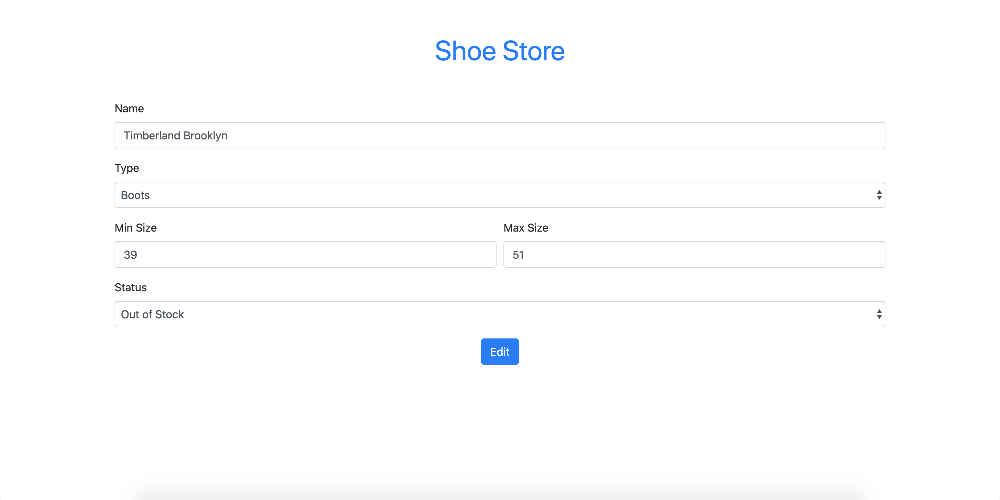

# Shoe Store

_⏰_ Time Estimation ~150 minutes

### Livecode Phase 1 Week 3

Sebuah toko sepatu meminta bantuan kamu untuk membuat aplikasi yang melakukan listing terhadap sepatu-sepatu yang mereka jual.

## Release 0
Buatlah *DATABASE* dengan menggunakan PostgreSQL dengan nama `livecodep1w3`.
> Nama database WAJIB livecodep1w3

## Release 1
Buatlah file `setup.js` yang berfungsi untuk membuat table `Shoes` yang memiliki kolom-kolom sebagai berikut:

| Field         | Datatype | Modifiers   |
| ------------- | -------- | ----------- |
| id            | SERIAL   | PRIMARY KEY |
| name          | VARCHAR  | NOT NULL    |
| type          | VARCHAR  | NOT NULL    |
| minSize       | INTEGER  | NOT NULL    |
| maxSize       | INTEGER  | NOT NULL    |
| status        | VARCHAR  | NOT NULL    |

Jalankan file `setup.js` untuk membuat table `Shoes` di dalam database `livecodep1w3`.

**NOTE**
`minSize` dan `maxSize` adalah kolom yang digunakan untuk menyimpan ukuran terkecil dan terbesar yang dimiliki dari sebuah sepatu.

## Release 2
Buatlah file `seed.js` yang berfungsi untuk melakukan seeding data ke dalam table `Shoes` berdasarkan data dari `shoes.json`.

Jalankan file `seed.js` untuk melakukan seeding ke table `Shoes`.

## Release 3

Buatlah routing dengan menggunakan `ExpressJS` agar dapat melakukan CRUD operations dengan detail sebagai berikut:

| Method | Route             | Keterangan                                                                                                               |
| ------ | ----------------- | ------------------------------------------------------------------------------------------------------------------------ |
| GET    | /                 | Menampilkan semua sepatu yang ada dalam database                                                                         |
| GET    | /shoes/add        | Menampilkan halaman form untuk menambahkan data sepatu                                                                   |
| POST   | /shoes/add        | Menerima data yang dikirim dari halaman `/shoes/add` untuk melakukan _insertion_ ke dalam table `Shoes`                  |
| GET    | /shoes/edit/:id   | Menampilkan halaman form untuk mengedit data sepatu berdasarkan `id` yang dikirimkan                                     |
| POST   | /shoes/edit/:id   | Menerima data yang dikirim dari halaman `/shoes/edit` untuk melakukan _update_ data sepatu berdasarkan `id` yang dikirim |
| GET    | /shoes/delete/:id | Melakukan _delete_ data sepatu berdasarkan `id` yang dikirimkan                                                          |
> kamu bisa memanfaatkan file html di dalam folder template untuk membantu membuat tampilannya

## Release 4
### Halaman Home atau Route `/`
Implementasikan routing `/` dengan membuat halaman `Home` dimana halaman ini menampilkan semua sepatu yang ada pada database dalam bentuk list yang terdiri dari kolom id, name, type, size, status, dan action.

Pada kolom action terdapat 2 link yaitu `edit` dan `delete` yang masing-masing akan mengarah ke `/shoes/edit/:id` dan `/shoes/delete/:id`.

Data `minSize` dan `maxSize` ditampilkan dalam 1 table column Size dengan format `<minSize> - <maxSize>` seperti pada screenshot contoh berikut:

### Halaman Add Shoe atau Route `/shoes/add`
Halaman add akan menampilkan form untuk memasukkan data sepatu yang akan disimpan ke dalam database.

Untuk bagian `type` menggunakan select input yang terdapat 3 pilihan:
  - Formal
  - Casual
  - Boots

Untuk bagian `status` menggunakan select input yang terdapat 3 pilihan:
  - In Stock
  - Out of Stock
  - Discontinued

Apabila berhasil menambahkan sepatu maka halaman akan berpindah ke home atau `/`

### Halaman Edit Shoe atau Route `/shoes/edit/:id`
Halaman edit akan menampilkan form yang berisikan data sepatu yang akan diedit.

Saat form ini terbuka, pastikan semua input dan select option sudah terisi sesuai dengan data sepatu yang akan diedit.

Apabila berhasil mengedit sepatu maka halaman akan berpindah ke home atau `/`

### Delete Shoe atau Route `/shoes/delete/:id`
Untuk mengimplementasikan routing ini, kamu tidak perlu membuat halaman baru, tapi cukup dengan menekan tombol delete yang akan mengarahkan routing ke `/shoes/delete/:id` dimana proses delete akan dilakukan berdasarkan `id` yang dikirimkan. 

Apabila berhasil menghapus sepatu maka halaman akan berpindah ke home atau `/`

## Release 5
Buatlah validasi pada **server** untuk fitur `Add`, `Edit` dan `Delete`:

### Add dan Edit:
- `name` harus terdiri dari minimal 2 kata
- `minSize` dan `maxSize` hanya boleh `angka`
- `maxSize` harus lebih besar dari `minSize`

Jika kondisi diatas tidak terpenuhi maka data tidak akan bertambah/berubah dan tampilkan pesan error.

### Delete:
- Hanya sepatu dengan `status` **Discontinued** yang dapat dihapus

**NOTE**
Untuk pesan error bisa ditampilkan dengan menggunakan `res.send`. Pesan error bebas selama yang ditampilkan jelas dan sesuai dengan error yang terjadi.
